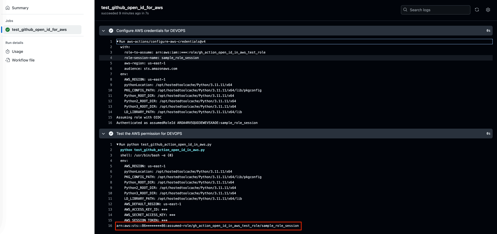

Quick Start
==============================================================================
This document shows how to use this Python library to set up an IAM Role for GitHub Actions to perform tasks in your AWS Account in minutes.

1. Setup GitHub Actions OIDC Provider in AWS
------------------------------------------------------------------------------
The first step is creating a GitHub Action OIDC Provider in your AWS account. This establishes trust between AWS and GitHub, confirming "this request is from a GitHub source I trust."

I recommend creating only the OIDC Provider initially, without IAM roles. This approach is optimal because you may need multiple IAM roles for different GitHub repositories, all of which can reuse the same OIDC provider.

Below is example code to create the OIDC provider in an AWS account.

.. dropdown:: example_1_setup_odic_provider.py

    .. literalinclude:: ./example_1_setup_odic_provider.py
       :language: python
       :linenos:

.. dropdown:: Console Logs

    .. code-block:: bash

        ======== 🚀 Deploy stack: github-action-oidc-provider =========
          📋 filter stack in AWS CloudFormation console: https://us-east-1.console.aws.amazon.com/cloudformation/home?region=us-east-1#/stacks?filteringText=github-action-oidc-provider&filteringStatus=active&viewNested=true
          🔎 create change set ...
            preview at: https://us-east-1.console.aws.amazon.com/cloudformation/home?region=us-east-1#/stacks/changesets/changes?stackId=arn:aws:cloudformation:us-east-1:111122223333:stack/github-action-oidc-provider/05f008c0-119d-11f0-bca6-128178eecf29&changeSetId=arn:aws:cloudformation:us-east-1:111122223333:changeSet/github-action-oidc-provider-2025-04-04-21-37-35-450/ea507e91-4c94-4e1b-ac47-5d4ec79c3e27
          wait for change set creation to finish ...
            on 1 th attempt, elapsed 5 seconds, remain 115 seconds ...
            reached status ChangeSetStatusEnum.CREATE_COMPLETE
                   >>> Change for stack github-action-oidc-provider <<<
        stack id = arn:aws:cloudformation:us-east-1:111122223333:stack/github-action-oidc-provider/05f008c0-119d-11f0-bca6-128178eecf29
        change set id = arn:aws:cloudformation:us-east-1:111122223333:changeSet/github-action-oidc-provider-2025-04-04-21-37-35-450/ea507e91-4c94-4e1b-ac47-5d4ec79c3e27
        +---------------------------- Change Set Statistics -----------------------------
        | 🟢 Add        1 Resource
        |
        +--------------------------------------------------------------------------------
        +----------------------------------- Changes ------------------------------------
        | 🟢 📦 Add Resource:        GitHubOIDCProvider    AWS::IAM::OIDCProvider
        |
        +--------------------------------------------------------------------------------
            need to execute the change set to apply those changes.
          + create new stack ...
            preview at: https://us-east-1.console.aws.amazon.com/cloudformation/home?region=us-east-1#/stacks/stackinfo?stackId=arn:aws:cloudformation:us-east-1:111122223333:stack/github-action-oidc-provider/05f008c0-119d-11f0-bca6-128178eecf29
          wait for deploy to finish , if failed, wait until rollback (if possible) is finished ...
            on 1 th attempt, elapsed 5 seconds, remain 115 seconds ...
            reached status 🟢 CREATE_COMPLETE
          done

         ...
         ...
         ...

2. Create IAM Role for GitHub Actions
------------------------------------------------------------------------------
Now you need to create an IAM Role that GitHub Actions can assume to perform operations in your AWS Account.

Below is example code to create the IAM Role for your GitHub Actions.

.. dropdown:: example_2_setup_iam_role_for_github_repo.py

    .. literalinclude:: ./example_2_setup_iam_role_for_github_repo.py
       :language: python
       :linenos:

.. dropdown:: Console Logs

    .. code-block:: bash

        ========================= 🚀 Deploy stack: gh-action-open-id-in-aws-test-role =========================
          📋 filter stack in AWS CloudFormation console: https://us-east-1.console.aws.amazon.com/cloudformation/home?region=us-east-1#/stacks?filteringText=gh-action-open-id-in-aws-test-role&filteringStatus=active&viewNested=true
          🔎 create change set ...
            preview at: https://us-east-1.console.aws.amazon.com/cloudformation/home?region=us-east-1#/stacks/changesets/changes?stackId=arn:aws:cloudformation:us-east-1:111122223333:stack/gh-action-open-id-in-aws-test-role/a65ebe50-119d-11f0-8dde-0e45891c840f&changeSetId=arn:aws:cloudformation:us-east-1:111122223333:changeSet/gh-action-open-id-in-aws-test-role-2025-04-04-21-42-04-600/f3f406c1-b413-40cf-b4d7-8f8f6fca6579
          wait for change set creation to finish ...
            on 1 th attempt, elapsed 5 seconds, remain 115 seconds ...
            reached status ChangeSetStatusEnum.CREATE_COMPLETE
                >>> Change for stack gh-action-open-id-in-aws-test-role <<<
        stack id = arn:aws:cloudformation:us-east-1:111122223333:stack/gh-action-open-id-in-aws-test-role/a65ebe50-119d-11f0-8dde-0e45891c840f
        change set id = arn:aws:cloudformation:us-east-1:111122223333:changeSet/gh-action-open-id-in-aws-test-role-2025-04-04-21-42-04-600/f3f406c1-b413-40cf-b4d7-8f8f6fca6579
        +---------------------------- Change Set Statistics -----------------------------
        | 🟢 Add        1 Resource
        |
        +--------------------------------------------------------------------------------
        +----------------------------------- Changes ------------------------------------
        | 🟢 📦 Add Resource:        GitHubActionRole    AWS::IAM::Role
        |
        +--------------------------------------------------------------------------------
            need to execute the change set to apply those changes.
          + create new stack ...
            preview at: https://us-east-1.console.aws.amazon.com/cloudformation/home?region=us-east-1#/stacks/stackinfo?stackId=arn:aws:cloudformation:us-east-1:111122223333:stack/gh-action-open-id-in-aws-test-role/a65ebe50-119d-11f0-8dde-0e45891c840f
          wait for deploy to finish , if failed, wait until rollback (if possible) is finished ...
            on 5 th attempt, elapsed 25 seconds, remain 95 seconds ...
            reached status 🟢 CREATE_COMPLETE
          done

.. note::

   The created IAM role won't have any permission, you need to configure it yourself. Usually, GitHub action is used for CI/CD, you may need the following permissions to perform common CI/CD tasks.:

    1. Manage (Create / Update / Delete) IAM Role / Policy
    2. Manage (Create / Update / Delete) AWS CloudFormation stack.
    3. Manage (Create / Update / Delete) AWS S3 Bucket to read / write deployment artifacts.
    4. Manage (Create / Update / Delete) AWS Parameter Store to read and write parameters.
    5. Manage (Create / Update / Delete) AWS ECR to push and pull container images and share it to workload AWS accounts.
    6. Manage (Create / Update / Delete) AWS EC2 AMI and share it to workload AWS accounts.
    7. Manage (Create / Update / Delete) AWS SNS Topic to send notifications.

.. tip::

    The GitHub IAM Role permission should define a common name prefix to identify devops resources from other resources, avoid using ``"Resource": "*"``.

3. Test IAM Role in GitHub Actions Workflow Run
------------------------------------------------------------------------------
Now, let's test the IAM Role in a real GitHub Action workflow run.

First, we need to prepare a script that uses the default credentials to create a boto3 session and print its own principal.

.. dropdown:: test_github_action_open_id_in_aws.py

    .. literalinclude:: ../../../test_github_action_open_id_in_aws.py
       :language: python
       :linenos:

Then we need to create a GitHub Actions workflow configuration file. This file uses the `configure-aws-credentials <https://github.com/marketplace/actions/configure-aws-credentials-action-for-github-actions>`_ GitHub action to assume the role you created in example 2.

.. dropdown:: main.yml

    .. literalinclude:: ../../../.github/workflows/main.yml
       :language: yaml
       :linenos:

Note that we don't want to expose the AWS Account ID to the public, so we've created a `GitHub Action secret <https://docs.github.com/en/actions/security-for-github-actions/security-guides/using-secrets-in-github-actions>`_ ``DEVOPS_AWS_ACCOUNT_ID``.

Finally, the GitHub Actions workflow run will look like this:

