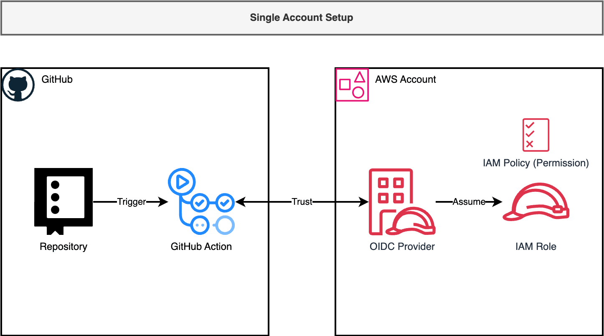
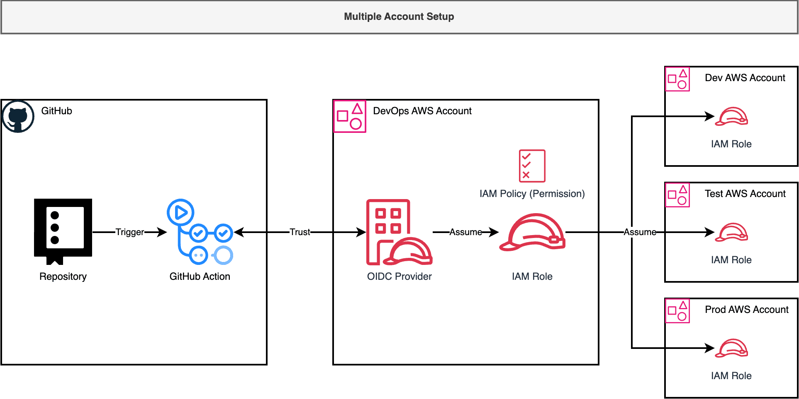
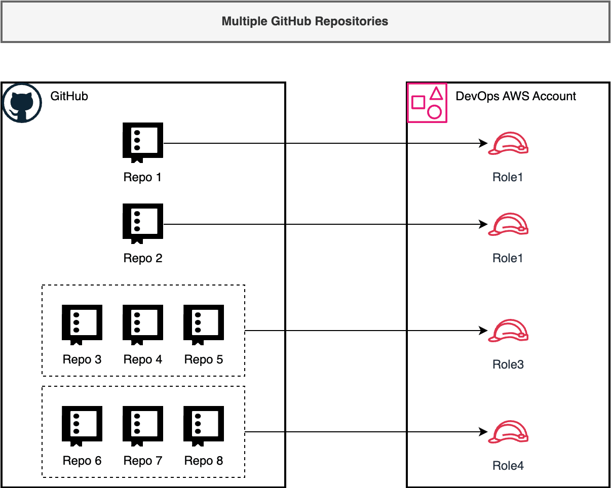

Best Practices
==============================================================================

Single Account Setup
------------------------------------------------------------------------------
If you have only one AWS account, create an OIDC Provider and a role for GitHub Actions with appropriate permissions for your workflows.

Multiple Accounts Setup
------------------------------------------------------------------------------
When deploying applications from GitHub Actions to multiple environments across multiple AWS accounts, follow these best practices:

Assume you have three workload AWS accounts (``dev``, ``test``, ``prod``) and a ``devops`` account for versioned code artifacts. These may be different AWS accounts or the same account with isolation by naming convention.

Create an OIDC Provider only in the DevOps account rather than in each account. This approach minimizes security exposure points. GitHub Actions assume a role in the ``devops`` account, which then assumes different roles in the workload accounts. Each role should have permissions specific to its intended work.

Multiple GitHub Repositories Setup
------------------------------------------------------------------------------
The main role (referred to as "OIDC Role") can be configured to control which repositories may assume it using the condition: ``"token.actions.githubusercontent.com:sub": "repo:${GitHubAccount}/${GitHubRepo}:${GitRef}"``.

For multiple repositories with different permission requirements:

1. Avoid using ``repo:${GitHubAccount}/*`` patterns that expose your role to all repositories in your account.
2. Generally, assign each repository a different role. Use consistent naming like ``gh_oidc-${repo_name}-${git_ref}``.
3. For repositories working on the same project, you can use patterns like ``repo:${GitHubAccount}/${GitHubRepoCommonPrefix}*:*`` or a list format ``["repo:${GitHubAccount}/${GitHubRepo1}:*", "repo:${GitHubAccount}/${GitHubRepo2}:*", ...]`` to allow related repositories to assume the same role.

